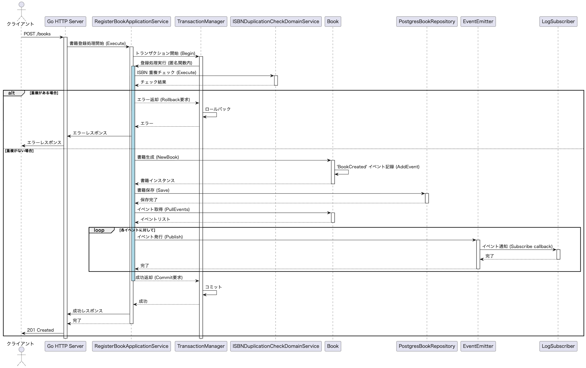

# ddd-hands-on-go

本プロジェクトは、TypeScriptで実装された [ddd-hands-on](https://github.com/yamachan0625/ddd-hands-on) をGo言語に移植したものです。ドメイン駆動設計（DDD）の原則とGo言語のベストプラクティスに基づき、堅牢で保守性の高いWebアプリケーションの実装を目指しています。

## 概要

- **言語**: Go 1.25+
- **アーキテクチャ**: オニオンアーキテクチャ / レイヤードアーキテクチャ
- **データベース**: PostgreSQL (ドライバー: `lib/pq`)
- **特徴**: ORMを使用せず、標準の `database/sql` を用いてSQLを明示的に記述することで、パフォーマンスとクエリの透明性を重視しています。

## プロジェクト構成

このプロジェクトは、Goの標準的なディレクトリ構成（Standard Go Project Layout）とDDDのレイヤー構造を組み合わせています。

```text
ddd-hands-on-go/
├── cmd/
│   └── api/
│       ├── handler/     # プレゼンテーション層: HTTPハンドラー
│       └── main.go      # エントリーポイント: 依存関係の注入とサーバー起動
├── internal/
│   ├── domain/          # ドメイン層: ビジネスロジックの中核
│   │   ├── model/       # エンティティ、値オブジェクト (Book, Price, Stockなど)
│   │   ├── service/     # ドメインサービス (重複チェックなど)
│   │   ├── repository/  # リポジトリインターフェース
│   │   └── shared/      # 共有ドメインカーネル (トランザクション管理、ドメインイベント定置など)
│   ├── application/     # アプリケーション層: ユースケースの実装
│   │   └── book/        # 書籍関連のユースケース (登録、取得)
│   └── infrastructure/  # インフラストラクチャ層: 技術的詳細の実装
│       ├── postgres/    # PostgreSQLによるリポジトリ実装
│       ├── event/       # インメモリイベントバス (EventEmitter) の実装
│       └── subscriber/  # イベントサブスクライバー (ログ出力など) の実装
├── scripts/
│   └── db/              # データベース関連スクリプト (初期化SQLなど)
├── tests/               # テストコード
│   ├── application/     # アプリケーション層のテスト
│   └── domain/          # ドメイン層のテスト
└── docker-compose.yml   # 開発環境用Docker構成 (PostgreSQL)
```

### アーキテクチャの解説

1.  **ドメイン層 (`internal/domain`)**:
    -   ビジネスルールとロジックをカプセル化します。他の層（DBやHTTPなど）には依存しません。
    -   `model`: データの整合性を保つため、コンストラクタ（`NewBook`など）を通じてのみオブジェクトを生成し、バリデーションを行います。

2.  **アプリケーション層 (`internal/application`)**:
    -   ドメインオブジェクトとリポジトリを組み合わせて、具体的なユースケース（「書籍を登録する」など）を実現します。
    -   トランザクション管理もこの層で行います。

3.  **インフラストラクチャ層 (`internal/infrastructure`)**:
    -   リポジトリインターフェースの具体的な実装（SQLの実行など）を提供します。

4.  **プレゼンテーション層 (`cmd/api/handler`)**:
    -   HTTPリクエストを受け取り、アプリケーションサービスを呼び出し、レスポンスを返します。

## 環境構築と実行

### 前提条件

- **Go**: バージョン 1.25 以上
- **Docker**: データベース（PostgreSQL）の起動に使用

### セットアップ手順

1.  **データベースの起動**
    Docker Composeを使用してPostgreSQLを起動します。このコマンドにより、ポート **5433** でDBが起動し、`scripts/db/init.sql` が自動的に実行されてテーブルが作成されます。

    ```bash
    docker compose up -d
    ```

    ※ *注意*: ローカルのPostgreSQL（ポート5432）との競合を避けるため、Dockerコンテナはポート **5433** を使用するように設定されています。

2.  **アプリケーションの起動**
    以下のコマンドでAPIサーバーを起動します。サーバーはポート **8080** で待機します。

    ```bash
    go run cmd/api/main.go
    ```

## APIの使用方法

### 1. 書籍の登録 (POST)

新しい書籍を登録します。

**リクエスト:**
```bash
curl -X POST -H "Content-Type: application/json" \
  -d '{"isbn":"978-4-00-111111-1", "title":"Test Book", "price_amount":1500}' \
  http://localhost:8080/books
```

**レスポンス:**
- `201 Created`: 登録成功
- `500 Internal Server Error`: サーバーエラー（またはISBN重複など）

### 2. 書籍の取得 (GET)

登録された書籍情報をISBNで検索して取得します。

**リクエスト:**
```bash
curl http://localhost:8080/books/978-4-00-111111-1
```

**レスポンス (JSON):**
```json
{
  "isbn": "978-4-00-111111-1",
  "title": "Test Book",
  "price_amount": 1500,
  "quantity_available": 0,
  "status": "OUT_OF_STOCK"
}
```

## テストの実行

プロジェクトには単体テストが含まれています。以下のコマンドですべてのテストを実行できます。

```bash
go test ./tests/...
```

## トラブルシューティング

- **データベースに接続できない**:
    - `docker compose ps` でコンテナ（`ddd-hands-on-postgres`）が起動しているか確認してください。
    - ポート **5433** が使用可能か確認してください。(`lsof -i :5433`)
- **テーブルが見つからないエラー**:
    - 初回起動時に初期化スクリプトが失敗した可能性があります。ボリュームを削除して再作成してください:
      ```bash
      docker compose down -v
      docker compose up -d
      ```
- **ビルドエラー**:
    - `go mod tidy` を実行して依存関係を整理してください。
# ddd-hands-on-go

